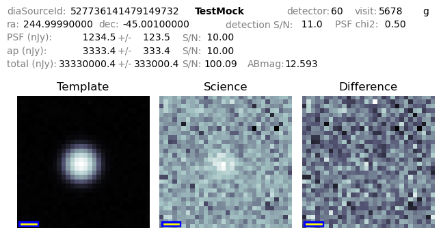

.. lsst-task-topic:: lsst.analysis.ap.PlotImageSubtractionCutoutsTask

###############################
PlotImageSubtractionCutoutsTask
###############################

``PlotImageSubtractionCutoutsTask`` is a task to generate 3-image cutouts (template, science, difference) of difference image sources loaded from a catalog or APDB.
The output images can be uploaded to a `Zooniverse`_ project, or used for investigating difference imaging performance.
This task reads the images from a butler repo, and writes its output as individual PNG files to the directory passed to the ``run`` method, or specified on the commandline.

``PlotImageSubtractionCutoutsTask`` is available on the command line as :doc:`plotImageSubtractionCutouts <../scripts/plotImageSubtractionCutouts>`.

.. _Zooniverse: https://www.zooniverse.org/

.. _lsst.analysis.ap.PlotImageSubtractionCutoutsTask-summary:

Processing summary
==================

``PlotImageSubtractionCutoutsTask`` runs this sequence of operations:

#. For each source in the input data, read the template, science, and difference image.

#. Cutout a region on each of those images (size determined by the config).

#. Make an image containing those cutout regions.

#. Write the image as a PNG to the specified output directory, using the ``diaSourceId`` as the filename.

.. _lsst.analysis.ap.PlotImageSubtractionCutoutsTask-api:

Python API summary
==================

.. lsst-task-api-summary:: lsst.analysis.ap.PlotImageSubtractionCutoutsTask

.. _lsst.analysis.ap.PlotImageSubtractionCutoutsTask-butler:

Butler datasets
===============

When run as the :doc:`plotImageSubtractionCutouts <../scripts/plotImageSubtractionCutouts>` command-line task, or directly through the `~lsst.analysis.ap.PlotImageSubtractionCutoutsTask.runDataRef` method, ``PlotImageSubtractionCutoutsTask`` obtains datasets from an input Butler data repository and a running APDB, but does not produce any output to the butler; the PNG image files are written to a specified directory.

.. _lsst.analysis.ap.PlotImageSubtractionCutoutsTask-butler-inputs:

Input datasets
--------------

``*_warpedExp``
    Template image that the template cutout is extracted from.

``calexp``
    Science image that the science cutout is extracted from.

``*_differenceExp``
    Difference image that the difference cutout is extracted from.

``*_diaSrc``
    DiaSource catalog measured on the difference image (used to load footprints when ``use_footprint==True``).

.. _lsst.analysis.ap.PlotImageSubtractionCutoutsTask-outputs:

Output datasets
===============

``PlotImageSubtractionCutoutsTask`` writes its output as PNG images to a specified directory, with the ``DiaSourceId`` of each source used as that PNG name.
These images are all of the same size and ordered as: template, science, difference.
The template and science iamges are min/max scaled with an ``asinh`` stretch, while the difference image is on a ``zscale`` with a linear stretch.

An example cutout image is shown below, in the format that would be most commonly used for a Zooniverse upload.

.. figure:: cutout_sample-plain.png
    :name: fig-cutout_sample-plain
    :alt: Basic image cutout, with no metadata.

    Basic image cutout, with no additional metadata.

The two below examples show what is produced when the ``addMetadata`` config field is set.
The first image shows a mocked image with no catalog flags set.
The source id, instrument, detector, visit, and filter name are given on the top row.
The pixel scale in arcseconds/pixel is shown as a small bar in the lower-left corner of each image.
The ``PSF`` and ``ap`` flux fields are fluxes on the difference image, while the ``total`` flux field is the forced flux on the science image, and the AB magnitude computed from that forced flux.
Note that there is no colored text; this would represent a likely good difference image source measurement.

    Cutout with metadata annotations, and no catalog flags set.

The second image shows a mocked image with all catalog flags set, representing a source with image and/or measurement problems.
The catalog flags are colored to match the `~lsst.afw.display.Display` mask plane colors.
The ``INTERP``, ``SAT``, ``CR``, and ``SUS`` annotations are displayed if either that catalog flag, or the equivalent ``"*Center"`` flag is set (e.g. ``INTERP`` is displayed if either ``interpolated`` or ``interpolatedCenter`` is set).
Also note that the ``PSF``, ``ap`` and ``total`` text labels are all in red: this signifies that the measurement algorithms for the PSF fit, aperture flux measurement, and forced PSF flux all had a flag set.
This example shows all flags set to showcase their positions and colors in the image.
In general, only a subset of these flags will be shown for any given source, but they will always be in the same position and color.
Detailed flag descriptions will eventually be available in the `SDM Schema browser`_;
until then, look at ``data/association-flag-map.yaml`` in `lsst.ap.association` for more information on these flags.

.. figure:: cutout_sample-flags.png
    :name: fig-cutout_sample-flags
    :alt: Cutout with metadata annotations, and all catalog flags set.

    Cutout with metadata annotations, and all catalog flags set.

**Generating Multi-size Cutouts**
---------------------------------

Multi-size cutouts can be generated by setting the ``config.sizes`` key.
The example image shown below contains cutouts of sizes 32x32 and 64x64 pixels.

    Multi-size image cutout, with no additional metadata.
    
Similarly, the image below shows an example of multi-size cutouts along with all catalog flags set.
This can be achieved by setting the ``config.add_metadata`` key to ``True``.

.. _SDM Schema browser: https://dm.lsst.org/sdm_schemas/browser/baseline.html#DiaSource

.. _lsst.pipe.tasks.characterizeImage.PlotImageSubtractionCutoutsTask-configs:

Configuration fields
====================

.. lsst-task-config-fields:: lsst.analysis.ap.PlotImageSubtractionCutoutsTask
